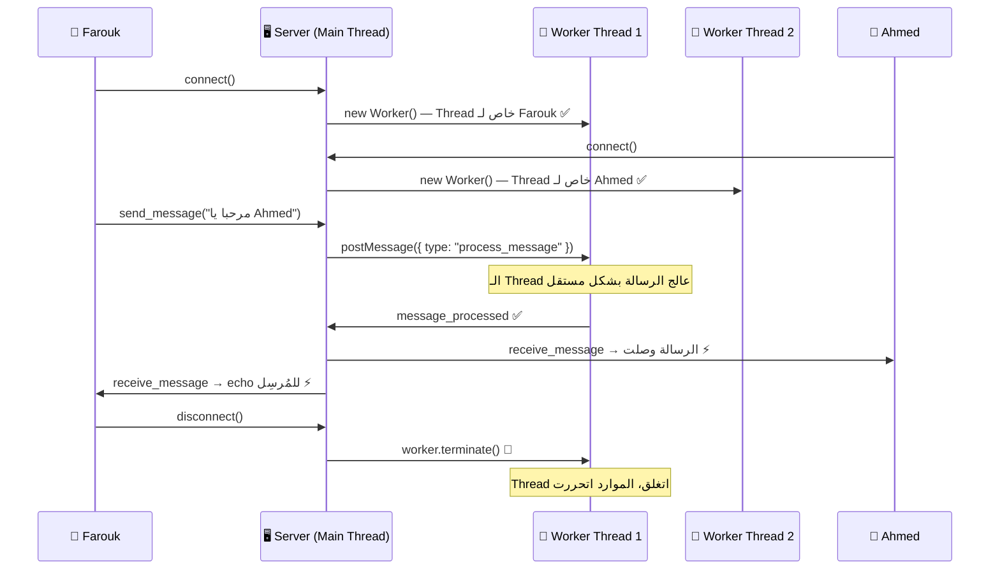

# 🧵 ThreadChat — ملخص المشروع

> **مادة:** System Programming | **المهمة:** تطبيق Multi-Threading باستخدام Worker Threads

---

## 💡 الفكرة الأساسية

المشروع عبارة عن **Chat App** بين مستخدمين، الهدف هو تطبيق مفهوم الـ **Multi-Threading**:

- كل مستخدم يتصل بالسيرفر → السيرفر يفتحله **Worker Thread خاص**
- الـ Thread ده مسؤول عن معالجة رسائل المستخدم ده بس
- لما المستخدم يخرج → الـ Thread يتغلق ويتحرر من الـ Memory

```
Main Thread (Server)
    ├── يوزر 1 اتصل → Worker Thread 1 🧵
    ├── يوزر 2 اتصل → Worker Thread 2 🧵
    └── يوزر 3 اتصل → Worker Thread 3 🧵
```

---

## 🔄 الـ Flow كامل



---

## 🗂️ هيكل المشروع

```
chat-app/
│
├── server/                      ← الـ Backend (Node.js)
│   ├── index.js                 ← Main Thread: HTTP + Socket.IO + Worker management
│   ├── worker.js                ← Worker Thread: معالجة الرسايل
│   ├── routes/authRoutes.js     ← API: /login و /register و /users
│   ├── controllers/authController.js
│   ├── models/User.js           ← SQLite Database Model
│   └── config/database.js
│
└── client/                      ← الـ Frontend (React)
    └── src/
        ├── App.js               ← Router: يعرض Login أو Chat
        ├── Chat.js              ← واجهة الشات + Socket.IO client
        ├── index.css            ← Glassmorphism dark theme
        └── pages/
            └── Login.js         ← Sign In + Register في صفحة واحدة
```

---

## ⚙️ الكود المهم — `server/index.js`

```javascript
// كل مستخدم يتصل → نعمله Worker Thread خاص
io.on("connection", (socket) => {
    const worker = new Worker("./worker.js"); // 🧵 Thread جديد

    // استلام الرسالة بعد معالجتها في الـ Thread
    worker.on("message", (msg) => {
        if (msg.type === "message_processed") {
            const { senderId, receiverId, message } = msg.data;
            // ابعت الرسالة للمستقبل
            io.to(users[receiverId]).emit("receive_message", msg.data);
            // وللمُرسِل (عشان الـ UI يتحدث)
            io.to(users[senderId]).emit("receive_message", msg.data);
        }
    });

    // لما يبعت رسالة → وفّضها للـ Thread يعالجها
    socket.on("send_message", (data) => {
        worker.postMessage({ type: "process_message", data });
    });

    // لما يخرج → أغلق الـ Thread
    socket.on("disconnect", () => {
        worker.terminate(); // 🛑 حرّر الـ Thread
    });
});
```

---

## 🚀 إزاي تشغّل المشروع

### Terminal 1 — Server
```powershell
cd "f:\4th Year\Second_Term\System_Programming\Section\chat-app\server"
node index.js
# ✅ Server running on port 5000
# ✅ Database connected
```

### Terminal 2 — Client
```powershell
cd "f:\4th Year\Second_Term\System_Programming\Section\chat-app\client"
npm start
# ✅ Compiled successfully!
# ✅ http://localhost:3000
```

> ⚠️ **Client بياخد وقت ~30-60 ثانية** للـ startup بسبب Webpack — طبيعي.

---

## 🧪 إزاي تتشيك على الـ Multi-Threading

| الخطوة | التفاصيل |
|--------|----------|
| **1** | افتح **Chrome** عادي → `http://localhost:3000` |
| **2** | Sign In بـ **Farouk** / باسورد: `1234` |
| **3** | افتح **Incognito** (Ctrl+Shift+N) → `http://localhost:3000` |
| **4** | Sign In بـ **Ahmed** / باسورد: `1234` |
| **5** | في تاب Farouk → اضغط على Ahmed → ابعت رسالة |
| **6** | شوف الرسالة وصلت في تاب Ahmed **real-time** ⚡ |

> ⚠️ **مهم:** لازم تفتح **Incognito** عشان الـ session يكون منفصل — لو فتحت تابين عاديين هيبقوا نفس اليوزر.

---

## 🔐 بيانات التجربة

| اليوزر | الباسورد |
|--------|----------|
| `Farouk` | `1234` |
| `Ahmed` | `1234` |

> لو محتاج تضيف يوزر جديد: افتح `localhost:3000` → Register tab → ادخل اسم وباسورد.

---

## 🖼️ الـ UI Features

| الميزة | التفاصيل |
|--------|----------|
| **Login/Register** | في نفس الصفحة بـ Tabs — مفيش auto-login |
| **Loading spinner** | أثناء تسجيل الدخول |
| **Error messages** | رسايل واضحة لو في مشكلة |
| **Exit button** | في الـ Sidebar لتغيير اليوزر |
| **Real-time chat** | الرسايل بتظهر فوراً بدون refresh |
| **Dark Glassmorphism** | تصميم عصري dark مع blur effects |

---

## 📌 نقاط مهمة للمراجعة مع المهندس وليد

1. **Multi-Threading** ✅ — كل connection عنده Worker Thread مستقل (`new Worker()`)
2. **Thread per user** ✅ — الـ Thread بيتعمل عند الـ connect وبيتغلق عند الـ disconnect
3. **Message processing in Thread** ✅ — الرسايل بتتعالج في `worker.js` مش في الـ Main Thread
4. **Resource cleanup** ✅ — `worker.terminate()` عند الخروج
5. **Real-time communication** ✅ — Socket.IO بين الـ clients

---

*آخر تحديث: 2026-04-27*
