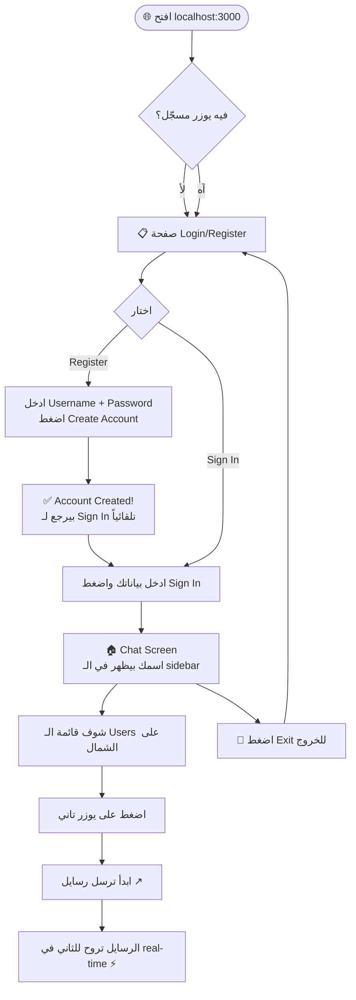
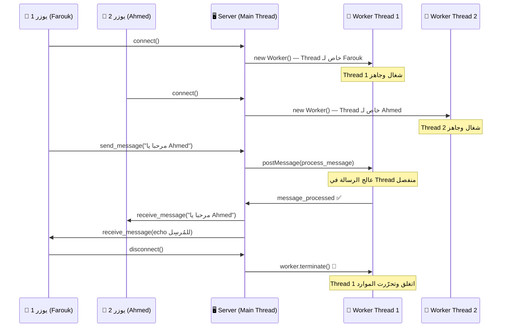

# ThreadChat — Workflow & Architecture

## 🔄 User Flow (إزاي تستخدم التطبيق)



---

## 🧵 Multi-Threading Flow (الفكرة التقنية)



---

## 🧪 إزاي تختبر الـ Chat

| الخطوة | التفاصيل |
|--------|----------|
| **1** | افتح **Chrome** عادي → `localhost:3000` → سجّل دخول بـ **Farouk** |
| **2** | افتح **نافذة Incognito** (Ctrl+Shift+N) → `localhost:3000` → سجّل دخول بـ **Ahmed** |
| **3** | في تاب Farouk، اضغط على **Ahmed** في القائمة |
| **4** | في تاب Ahmed، اضغط على **Farouk** في القائمة |
| **5** | ابعت رسايل من أي تاب وشوف الـ real-time! |

> ⚠️ **مهم:** لازم تفتح **Incognito** عشان الـ session يكون منفصل. لو فتحت تابين عاديين هيبقوا نفس اليوزر.

---

## 🏗️ Architecture Overview

```
chat-app/
├── server/               ← Node.js Backend
│   ├── index.js         ← Main Thread (HTTP + Socket.IO)
│   ├── worker.js        ← Worker Thread (معالجة الرسايل)
│   ├── routes/          ← API routes (login/register)
│   ├── controllers/     ← Business logic
│   └── models/          ← Database models (SQLite)
│
└── client/               ← React Frontend
    └── src/
        ├── App.js       ← Router (Login ↔ Chat)
        ├── Chat.js      ← Chat UI + Socket connection
        └── pages/
            └── Login.js ← Login + Register في صفحة واحدة
```
